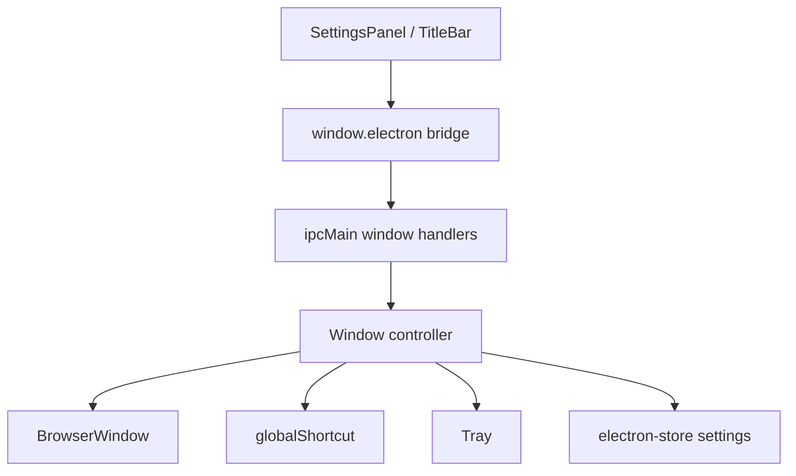

# Desktop Window Controls Design

**Spec**: `.specs/features/desktop-window-controls/spec.md`
**Status**: Draft

---

## Architecture Overview

O recurso deve introduzir uma camada explícita de controle de janela no processo
principal do Electron. Hoje `public/electron.js` acumula criação da janela, store e IPC
em um único arquivo; a nova implementação continua podendo viver no mesmo arquivo no
primeiro passo, mas precisa separar responsabilidades lógicas:

- criação/configuração da `BrowserWindow`
- registro e limpeza de `globalShortcut`
- gestão de `Tray`
- aplicação de preferências de janela persistidas
- ponte IPC/preload para o renderer



---

## Code Reuse Analysis

### Existing Components to Leverage

| Component | Location | How to Use |
| --- | --- | --- |
| Electron store bootstrap | `public/electron.js` | Estender `settings` defaults com preferências de janela |
| Preload bridge pattern | `public/preload.js` | Adicionar métodos de janela no mesmo padrão do bridge atual |
| Settings state lifecycle | `src/context/PomoContext.tsx` | Reaproveitar `settings` + `updateSettings` para refletir controles de opacidade e hotkeys |
| Settings UI rows | `src/components/SettingsPanel.tsx` | Reaproveitar `ToggleRow`, `RangeRow` e `DropdownRow` |
| Header shell atual | `src/components/Header.tsx` | Evoluir ou substituir por uma title bar dragável |
| Main app shell | `src/MainScreen.tsx` | Remover card fake e passar a usar o tamanho real da janela |

### Integration Points

| System | Integration Method |
| --- | --- |
| Electron `BrowserWindow` | `setOpacity`, `setIgnoreMouseEvents`, `minimize`, `hide`, `show`, `focus`, `restore` |
| Electron `globalShortcut` | Registro centralizado após `app.whenReady()` com re-registro ao mudar atalhos |
| Electron `Tray` | Instância única com menu de restaurar, alternar click-through e sair |
| Renderer settings flow | Persistência via `window.electron.setSettings()` e comandos específicos de janela |

---

## Components

### Window Controller

- **Purpose**: Encapsular operações de janela, tray e hotkeys no processo principal.
- **Location**: `public/electron.js` no primeiro ciclo; opcionalmente extraído depois para
  `public/windowController.js`.
- **Interfaces**:
  - `createMainWindow(): BrowserWindow` - cria a janela com frame customizado.
  - `applyWindowSettings(settings): void` - aplica opacidade, click-through inicial e
    comportamentos de tray.
  - `registerGlobalShortcuts(settings): void` - registra atalhos globais.
  - `focusMainWindow(): void` - restaura, mostra e foca a janela.
  - `toggleClickThrough(): { enabled: boolean }` - alterna recebimento de cliques.
- **Dependencies**: `BrowserWindow`, `Tray`, `Menu`, `globalShortcut`, `electron-store`.
- **Reuses**: bootstrap e store atuais de `public/electron.js`.

### Preload Window Bridge

- **Purpose**: Expor APIs seguras de janela ao renderer.
- **Location**: `public/preload.js`
- **Interfaces**:
  - `setWindowOpacity(opacity: number): Promise<void>`
  - `toggleClickThrough(): Promise<{ enabled: boolean }>`
  - `focusMainWindow(): Promise<void>`
  - `windowMinimize(): Promise<void>`
  - `subscribeWindowState?(callback): unsubscribe`
- **Dependencies**: `ipcRenderer`, canais IPC do processo principal.
- **Reuses**: padrão existente de `window.electron`.

### Desktop Title Bar

- **Purpose**: Substituir a barra nativa por uma shell alinhada ao design do app.
- **Location**: `src/components/Header.tsx` ou novo `src/components/TitleBar.tsx`
- **Interfaces**:
  - `onMinimize()`
  - `onClose()`
  - `onToggleClickThrough()` opcional
- **Dependencies**: bridge do preload, classes CSS com `-webkit-app-region`.
- **Reuses**: branding atual do header (`Coffee`, `PomoBeats`).

### Window Settings UI

- **Purpose**: Permitir configurar opacidade, behavior de tray e atalhos.
- **Location**: `src/components/SettingsPanel.tsx`
- **Interfaces**:
  - atualização parcial de `SettingsState`
- **Dependencies**: `PomoContext`, componentes de formulário já existentes.
- **Reuses**: `RangeRow`, `ToggleRow`, `DropdownRow`.

---

## Data Models

### Window Settings Extension

```ts
interface WindowHotkeys {
  toggleClickThrough: string
  focusWindow: string
}

interface SettingsState {
  // campos existentes...
  windowOpacity: number
  clickThroughEnabled: boolean
  minimizeToTray: boolean
  hotkeys: WindowHotkeys
}
```

**Relationships**:

- `SettingsState` continua sendo a fonte persistida em `electron-store`.
- `clickThroughEnabled` precisa refletir tanto estado persistido quanto estado aplicado à
  `BrowserWindow`.
- `hotkeys` dirige o registro de `globalShortcut`.

---

## Error Handling Strategy

| Error Scenario | Handling | User Impact |
| --- | --- | --- |
| Hotkey global não registra | cair para atalho padrão seguro, logar erro e manter app utilizável | usuário perde customização, não perde controle do app |
| Valor de opacidade inválido | normalizar para intervalo permitido antes de aplicar | janela continua visível |
| Ícone da tray ausente | falha explícita em dev e instrução clara para asset obrigatório | evita comportamento silencioso quebrado |
| Janela em click-through sem feedback | expor indicador visual de estado e hotkey dedicada de foco | reduz risco de “perder” o app |

---

## Tech Decisions

| Decision | Choice | Rationale |
| --- | --- | --- |
| Frame da janela | `frame: false` | necessário para title bar customizada |
| Tamanho base da janela | derivado do layout real do app | elimina card fake interno e espaço ocioso |
| Persistência de preferências | continuar em `electron-store` | já é o padrão do projeto |
| Registro de hotkeys | `globalShortcut` no processo principal | API nativa do Electron para atalhos globais |
| Tray | instância única no processo principal | simplifica restore/focus e ciclo de vida |

---

## Implementation Notes

- Antes de ativar `frame: false`, a UI precisa ter controles de janela mínimos e área
  dragável confiável.
- A recuperação da janela por hotkey é pré-requisito de segurança antes de depender de
  click-through e tray.
- O projeto ainda não possui asset de ícone em `public/`; isso deve entrar como entrega
  explícita da feature.
